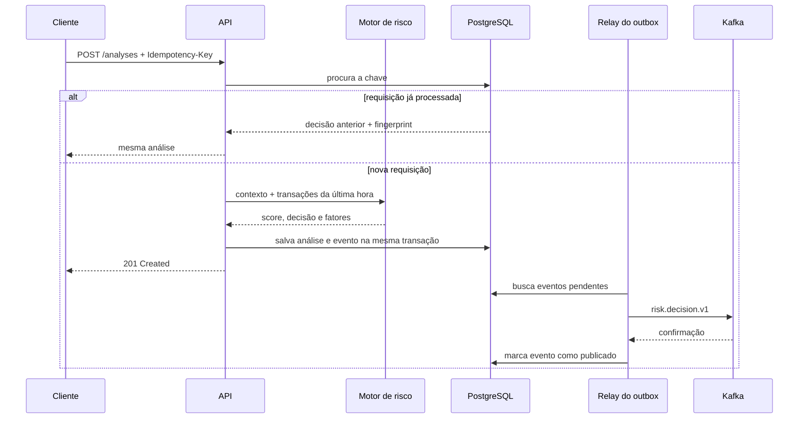

# Sentinel Risk Service

[](https://github.com/pedroigor-dev/sentinel-risk-service/actions/workflows/ci.yml)
[](https://github.com/pedroigor-dev/sentinel-risk-service/actions/workflows/codeql.yml)
[](https://openjdk.org/projects/jdk/21/)
[](https://spring.io/projects/spring-boot)
[](pom.xml)
[](LICENSE)

Um `POST` chega duas vezes porque o cliente perdeu a resposta. A decisão foi salva, mas o Kafka caiu logo depois. O que o serviço faz agora?

O Sentinel nasceu para responder a esse tipo de pergunta. Ele analisa o risco de uma transação, explica a pontuação, trata repetições com idempotência e registra o evento na mesma transação do banco. O envio ao Kafka acontece por um relay de outbox e aceita duplicatas como parte do contrato.

## O que este projeto demonstra

| Tema | Evidência no código |
|---|---|
| Regras de domínio | Cinco regras pequenas, combináveis e testadas sem Spring |
| API resiliente | `Idempotency-Key`, validação e respostas Problem Details |
| Consistência | Análise e evento gravados na mesma transação PostgreSQL |
| Mensageria | Relay para Kafka com confirmação, tentativa e entrega pelo menos uma vez |
| Segurança | API key, comparação em tempo constante e correlation ID sanitizado |
| Operação | Health probes, métricas Prometheus, logs correlacionados e graceful shutdown |
| Qualidade | JUnit, testes de integração, JaCoCo, Checkstyle, SpotBugs e CodeQL |
| Supply chain | Maven Wrapper com checksum, Dependabot e SBOM CycloneDX |

## Caminho de uma análise



## Regras do motor

O motor soma sinais. A ordem dos fatores na resposta segue a pontuação, o que ajuda uma pessoa a entender rapidamente por que uma transação foi retida.

| Sinal | Pontos |
|---|---:|
| Valor a partir de 5.000 | 20 |
| Valor a partir de 10.000 | 35 |
| País da compra diferente do país do cartão | 25 |
| MCC 6051 ou 7995 | 30 |
| Compra entre 00:00 e 06:00 UTC | 15 |
| Três ou mais transações do cliente na última hora | 30 |

- `0 a 39`: `APPROVED`
- `40 a 69`: `REVIEW`
- `70 a 100`: `DECLINED`

As regras são didáticas, não um modelo antifraude pronto para produção. Em um sistema real, pesos e limiares dependeriam de dados históricos, revisão de vieses e acompanhamento de falsos positivos.

## Executar com Docker Compose

Você precisa do Docker com Compose v2.

```bash
docker compose up --build
```

O ambiente sobe PostgreSQL 18, Kafka 4.3.1 e a aplicação. A chave local é `local-development-key`; ela existe apenas para facilitar a demonstração.

```bash
curl --request POST http://localhost:8080/api/v1/analyses \
  --header "Content-Type: application/json" \
  --header "X-API-Key: local-development-key" \
  --header "Idempotency-Key: demo-2026-0001" \
  --data '{
    "transactionId": "tx-2026-0001",
    "customerId": "customer-42",
    "amount": 12500.00,
    "currency": "BRL",
    "originCountry": "BR",
    "cardCountry": "US",
    "merchantCategory": "7995",
    "occurredAt": "2026-08-16T12:00:00Z"
  }'
```

Resposta esperada, com identificadores e horário diferentes a cada nova chave:

```json
{
  "analysisId": "9ae26665-54f7-4a23-9873-80d4c6b96197",
  "transactionId": "tx-2026-0001",
  "customerId": "customer-42",
  "score": 90,
  "decision": "DECLINED",
  "factors": [
    {"code": "HIGH_AMOUNT", "points": 35, "explanation": "Transaction amount is at least 10,000.00"},
    {"code": "HIGH_RISK_MERCHANT", "points": 30, "explanation": "Merchant category has a higher fraud exposure"},
    {"code": "COUNTRY_MISMATCH", "points": 25, "explanation": "Transaction and card countries do not match"}
  ],
  "analyzedAt": "2026-08-16T15:00:00Z"
}
```

Reenvie o mesmo corpo e a mesma `Idempotency-Key`: o `analysisId` será preservado. Troque o corpo e mantenha a chave: a API responderá `409 Conflict`.

## Executar os testes

O projeto exige JDK 21. O Maven é baixado pelo wrapper e validado por SHA-256.

```bash
./mvnw clean verify
```

Esse comando roda testes unitários e de integração, exige 85% de cobertura de linhas, verifica estilo, executa SpotBugs e gera o SBOM em `target/bom.json`.

## Observabilidade

- `GET /actuator/health`: público, para liveness e readiness.
- `GET /actuator/prometheus`: exige `X-API-Key`.
- `sentinel_outbox_published_total`: eventos confirmados pelo Kafka.
- `sentinel_outbox_failed_total`: tentativas de publicação que permaneceram pendentes.
- `X-Correlation-ID`: aceito quando contém somente caracteres seguros; caso contrário o serviço gera um UUID.

## Contrato de entrega do evento

O relay oferece entrega pelo menos uma vez. Há uma janela pequena entre a confirmação do Kafka e o commit que marca o outbox como publicado. Uma queda nesse intervalo pode produzir uma duplicata. Consumidores devem deduplicar por `eventId`.

Preferi deixar essa limitação visível. Prometer exatamente uma vez sem controlar produtor, broker, armazenamento e consumidor esconderia o problema em vez de resolvê-lo.

## Estrutura

```text
src/main/java/dev/pedrocosta/sentinel
|-- application       casos de uso e portas
|-- configuration     composição, segurança e propriedades
|-- domain            modelos, regras e motor de decisão
|-- infrastructure    JPA, outbox e Kafka
`-- presentation      contrato HTTP
```

## Documentação

- [Contrato OpenAPI](docs/api/openapi.yaml)
- [Arquitetura e limites](docs/architecture.md)
- [ADRs](docs/adr/)
- [Threat model](docs/security/threat-model.md)
- [POC em padrão acadêmico](docs/poc/)
- [Roteiro de publicações para LinkedIn](docs/linkedin/)
- [Como contribuir](CONTRIBUTING.md)
- [Política de segurança](SECURITY.md)

## Decisões que eu revisitaria

- A API key atende ao recorte do projeto, mas OAuth 2.1 com credenciais de máquina seria mais adequado entre serviços de uma empresa.
- O relay segura uma transação do banco enquanto aguarda o Kafka. Em volume alto, eu adotaria claim curto com `SKIP LOCKED` e confirmação em uma segunda transação.
- H2 acelera a suíte. Um pipeline de homologação também deveria rodar testes com PostgreSQL e Kafka reais via Testcontainers.
- As regras usam pesos fixos. O próximo passo técnico seria versionar políticas e medir falsos positivos antes de alterar limiares.

## Autor

Pedro Igor Campos Costa - [GitHub](https://github.com/pedroigor-dev)

Projeto de portfólio. Não use estas regras para autorizar transações financeiras reais.
