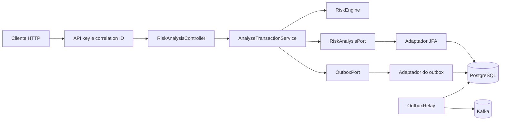

# Arquitetura e limites

## Objetivo

O Sentinel recebe uma transação, calcula um risco explicável e publica o resultado para outros serviços. O desenho separa o motor de regras dos detalhes de HTTP, banco e Kafka para que as decisões possam ser testadas sem subir o framework.

## Componentes

O pacote `domain` não importa Spring. `application` conhece portas e contém a fronteira transacional. Adaptadores em `infrastructure` implementam essas portas. A camada HTTP apenas valida, converte e apresenta o resultado.

## Invariantes

- Uma análise aceita possui score entre 0 e 100.
- A mesma chave de idempotência e o mesmo fingerprint retornam a decisão já salva.
- A mesma chave com outro fingerprint resulta em conflito.
- A análise e o evento de outbox entram no banco na mesma transação.
- Um evento só recebe status `PUBLISHED` depois da confirmação do Kafka.
- Falhas de publicação mantêm o evento pendente para a próxima varredura.

## Consistência e concorrência

A restrição única em `risk_analyses.idempotency_key` é a última barreira contra duplicidade. Duas requisições concorrentes podem calcular o risco ao mesmo tempo; uma delas vencerá a inserção e a outra receberá conflito. Um cliente pode repetir a chamada e obter o registro vencedor.

Essa escolha evita locks distribuídos no escopo atual. Uma versão com maior volume poderia reservar a chave em uma tabela própria e distinguir estados `PROCESSING`, `COMPLETED` e `FAILED`.

## Modelo de entrega

O banco resolve o dual write: não existe análise confirmada sem evento pendente. O relay resolve a publicação assíncrona. O sistema ainda pode publicar o mesmo evento mais de uma vez se cair depois do ack do Kafka e antes do commit do status. `eventId` existe para a deduplicação do consumidor.

## Escalabilidade

O índice `(customer_id, occurred_at)` atende à contagem de velocidade. Em grandes volumes, esse cálculo migraria para uma janela em stream ou um contador com expiração. O histórico relacional continuaria como fonte de auditoria, não como contador online.

O relay lê cinquenta registros por ciclo. Múltiplas instâncias exigiriam claim com lock pessimista ou `FOR UPDATE SKIP LOCKED`; sem isso, elas podem publicar duplicatas adicionais. A semântica do contrato já permite duplicatas, mas o ruído operacional aumentaria.

## Dados e privacidade

O exemplo não armazena PAN, CVV, nome ou documento. `customerId` e `transactionId` devem ser identificadores opacos. Logs não incluem payload nem API key. O período de retenção deve ser definido antes de uma implantação real.

## Operação

Health probes verificam a aplicação e suas dependências registradas. Métricas do relay distinguem confirmações e falhas. O correlation ID viaja na resposta e no MDC, o que permite relacionar logs sem aceitar caracteres capazes de forjar linhas.

## Limites conhecidos

- As políticas de risco não têm versionamento.
- Não há endpoint administrativo para reprocessar ou estacionar eventos.
- Não existe dead-letter queue após um número máximo de tentativas.
- API key é um mecanismo simples de autenticação entre máquinas.
- Testes locais usam H2 em modo PostgreSQL; diferenças de dialeto ainda podem escapar.
