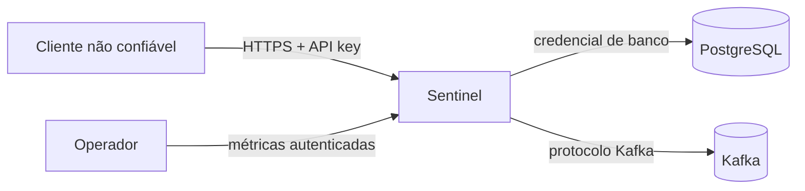

# Threat model

## Escopo

Este documento cobre a API HTTP, PostgreSQL, o relay do outbox e a publicação no Kafka. Ele não cobre o consumidor do evento nem a gestão corporativa de identidades.

## Ativos

- Decisões de risco e seus fatores.
- Identificadores opacos de cliente e transação.
- Chaves de idempotência e API key.
- Integridade dos eventos publicados.
- Disponibilidade da análise e do relay.

## Fronteiras de confiança

## Ameaças e controles

| Ameaça | Controle atual | Lacuna restante |
|---|---|---|
| Repetição de requisição | Chave de idempotência, fingerprint e restrição única | Corrida pode devolver 409 antes do retry |
| Uso de chave roubada | Segredo externo e comparação em tempo constante | Sem identidade, escopo ou rotação automática |
| Injeção SQL | JPA com parâmetros e Flyway | Queries nativas futuras precisam de revisão |
| Log forging | Correlation ID limitado a caracteres seguros | Logs do runtime e proxy também precisam de política |
| Payload malformado | Bean Validation e limites de tamanho | Limite global do corpo deve existir no gateway |
| Dual write | Outbox na mesma transação da análise | Publicação pode duplicar após falha entre ack e commit |
| Evento preso | Contador de falha e registros pendentes | Falta alerta e dead-letter operacional |
| Exposição de dados | O serviço não recebe dados de cartão | Retenção e criptografia em repouso dependem da plataforma |
| Abuso de volume | Autenticação e limites de conexão do servidor | Rate limit deve ser aplicado no gateway |

## Recomendações para produção

- Terminar TLS no ingress e usar mTLS na comunicação interna sensível.
- Trocar API key por credenciais OAuth 2.1 de máquina e rotação automática.
- Guardar segredos em cofre, nunca em arquivo de ambiente versionado.
- Restringir Kafka e PostgreSQL por rede e identidade de workload.
- Alertar sobre idade e quantidade de eventos pendentes.
- Definir retenção, exclusão e trilha de auditoria antes de aceitar dados reais.
- Testar migrations e concorrência contra PostgreSQL, em vez de restringir a validação ao H2.
